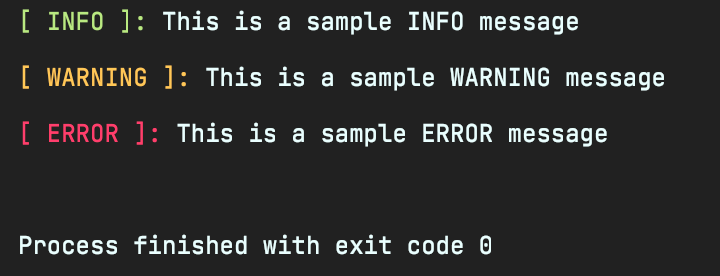

# Compiler Principle Project
小组成员：刘舒菡，范钊瑀，季文卓
## 1 基本信息 

### 1.1 总体介绍 

我们自己设计了一个新语言并且为这个语言设计完成了一个编译器。以下是我们使用的主要工具：

+ flex
+ bison
+ LLVM
+ CMake Makefile

### 1.2 小组分工 

我们小组由三位同学组成，以下是我们的主要分工：

+ 刘舒菡：词法分析，AST设计与构建，测试用例快速排序
+ 范钊瑀：语法设计，AST可视化，符号表与函数表，测试用例选课助手，进阶主题
+ 季文卓：语法分析，中间代码生成，测试用例矩阵乘法

## 2 语法定义
### 2.1 程序结构
我们所设计的语言和c语言十分类似
整体程序由两部分构成，全局变量定义部分在上，函数部分在下。在全局作用范围内只能够定义全局变量，局部变量需要定义在函数内部。但是为了保证全局变量的安全，在全局定义区域不可以对全局变量进行赋值等操作。

在函数内部，也分为两部分，第一部分是函数内部变量定义，第二部分是函数中的其它表达式和语句，在函数中可以对全局变量进行操作，也可以对函数内部的局部变量进行操作。

### 2.2 数据类型
我们的语法中拥有两种基本数据类型，分别为整型int和浮点型float，两种数据类型都能够定义变量或数组，也可定义高维数组，数组每一维的长度需要在定义时确定，定义规范如下：
```c--
/* 变量定义 */
int a;
float b,c;
/* 数组定义 */
int a_array[10];
float b_array[10][20];
```

### 2.3 基本语法规则
#### 2.4 表达式语句
流程控制包含`if  else  while  return  break  continue`等语句，使用方法与c语言类似，代码段使用大括号`{}`包围，条件可以用`()`包围，例如：
```c--
/* 条件语句定义 */
if(STATEMENT){
  ...程序语句
}
else{
  ...程序语句
}

/* 循环定义 */
while(STATEMENT){
  ...程序语句
  continue;
}

```

#### 2.5 函数语句
函数语句使用关键词`function`定义，定义形式如下，其中小写的token代表不能改变的元素，大写的token可以根据具体情况自定义。
```c--
/* 函数定义 */

function RETURN_TYPE FUNCTINO_NAME( [PARAM LIST] ){
  ...程序语句
  return VALUE;
}
```

## 3 功能实现 

### 3.1 词法分析

我们主要采用了lex工具帮助我们来完成词法分析。将输入的文件转换为token流。具体的代码见scanner.l。

**注释**

我们的注释采用类似c语言的注释`/*注释*/`

+ 用正则表达式`/*"([^\*]|(\*)*[^\*/])*(\*)*"*/`来识别

**表达式**

我们将表达式分为以下几种类型：

+ 关系表达式：==  <=  >=  !=  <  >
+ 赋值表达式：=
+ 逻辑表达式：||  &&  !
+ 四则运算表达式：+  -  *  /

**特殊符号**

我们的语言还有以下一些特殊的符号：

+ 分号：`；`
+ 逗号：`，`
+ 点：`.`
+ 小括号：`（）`
+ 中括号：`[]`
+ 大括号：`{}`

**关键字**

我们的语言拥有以下这些关键字：

+ 类型：int  float  void  function
+ 流程控制：if  else  while  return  break  continue
+ 标准输入输出：cin  cout

**变量名**

我们对变量名做出如下规定：

+ 以字母或下划线开头
+ 由字母或数字或下划线组成
+ 不能与关键字重复
+ 用正则表达式`[_a-zA-Z][0-9_a-zA-Z]*`来识别变量名

**整数和浮点数**

+ 整数：用正则表达式`(0|([1-9]{digit}*))`来识别整数
+ 浮点数：用正则表达式`(0|([1-9]{digit}*))"."[0-9]*`来识别浮点数

**格式化输入输出**

+ 我们的输入输出格式是`cin("%d", &a);`
+ 为了达到输入输出的目的，我们需要匹配“%d”，用正则表达式`\"(\\.|[^"\\])*\"`来匹配格式化输入输出

### 3.2 语法分析

我们主要采用了yacc来帮助我们完成语法分析。即输入一串token流，匹配对应的语法，并转换为AST中的节点。具体的代码见parser.y。

以下是所有token流中的终结符：

```
%token<type_int> INT
%token<type_float> FLOAT
%token<type_str> ID FormatStr
%token<type_token> EQUAL LE GE NE LESS GREATER
%token<type_token> ASSIGN
%token<type_token> OR AND NOT
%token<type_token> ADD MINUS MULT DIV
%token<type_token> QUOT PERCENT LOGICAND LINEBREAK PERCENTD PERCENTF
%token<type_token> SEMI COMMA DOT LP RP LB RB LC RC
%token<type_token> IF ELSE WHILE TYPEINT TYPEFLOAT TYPEVOID RETURN BREAK CONTINUE FUNCTION INPUT OUTPUT
```

以下是所有非终结符，他们的类型都是AST树中的节点：

```
%type <type_ast>    Program Def_List Fun_List Var Var_List Fun Fun_Var_List Fun_Var VarDec
%type <type_ast>    AST_Type CBlock Stmt_List Stmt IF_Stmt If_Else_Stmt While_Stmt Input_Exp Output_Exp Exp Args
```

我们用到的语法规则如下：

**BASIC**

+ 整个程序分为变量定义部分和函数部分

  ```
  Program : Def_List Fun_List
  ```

+ 变量部分由很多变量定义例如`int a,b,c;`组成；函数部分由许多个函数组成

  ```
  //变量定义部分。
  Def_List -> Def_List Var SEMI| ɛ
  
  //函数部分
  Fun_List -> Fun_List Fun | ɛ
  ```

+ 变量定义语法

  ```
  //一条变量声明。例如int a,b,c[3]
  Var -> AST_Type Var_List
  
  //变量列表。例如a,b,c[3]
  Var_List -> Var_List COMMA VarDec | VarDec
  
  //单个变量。变量名可能是多维数组
  VarDec -> ID | VarDec LB INT RB        
  ```

+ 变量类型

  ```
  //主要有三种类型。int，float，void
  AST_Type -> TYPEINT | TYPEFLOAT | TYPEVOID
  ```

+ 函数部分语法

  ```
  //一个函数。函数可以有参或者无参，AST_Type是函数的返回值类型，CBlock是函数的主体部分
  Fun -> FUNCTION AST_Type ID LP Fun_Var_List RP CBlock |FUNCTION AST_Type ID LP RP CBlock 
  
  //函数参数列表。例如int a,float b[3]
  Fun_Var_List -> Fun_Var_List COMMA Fun_Var | Fun_Var
  
  //单个函数参数。例如int a
  Fun_Var -> AST_Type VarDec
  
  //函数主体部分。分为变量定义部分和语句部分（例如if，while等语句块）
  CBlock -> LC Def_List Stmt_List RC
  ```

**STATEMENT**

+ 语句列表

  ```
  //一个语句列表中可以有多个语句
  Stmt_List -> Stmt_List Stmt | Stmt
  ```

+ 语句

  ```
  //一个Statement可以是一个语句，也可以是一个语句段，即CBLOCK
  Stmt -> Exp SEMI
       | CBlock
       | RETURN SEMI
       | RETURN Exp SEMI
       | IF_Stmt
       | If_Else_Stmt
       | While_Stmt
       | Input_Exp SEMI 
       | Output_Exp SEMI 
  ```

+ 语句类型

  ```
  //if语句块
  IF_Stmt -> IF LP Exp RP CBlock
  
  //if，else语句块
  If_Else_Stmt -> IF LP Exp RP CBlock ELSE CBlock
  
  //while循环语句块
  While_Stmt -> WHILE LP Exp RP CBlock
  
  //输入语句块
  Input_Exp -> INPUT LP FormatStr COMMA Args RP
  
  //输出语句块
  Output_Exp -> OUTPUT LP FormatStr COMMA Args RP | OUTPUT LP FormatStr RP
  ```

**EXPRESSION**

+ 表达式类型

  ```
  Exp -> Exp ASSIGN Exp   //赋值表达式
      | Exp AND Exp       //和运算表达式
      | Exp OR Exp        //或运算表达式
      | Exp ADD Exp       //加运算表达式
      | Exp MINUS Exp     //减运算表达式
      | Exp MULT Exp      //乘运算表达式
      | Exp DIV Exp       //除运算表达式
      | Exp EQUAL Exp     //==
      | Exp LE Exp        //<=
      | Exp GE Exp        //>=
      | Exp NE Exp        //!=
      | Exp LESS Exp      //<
      | Exp GREATER Exp   //>
      | LOGICAND Exp      //&
      | LP Exp RP         //()
      | MINUS Exp         //-
      | NOT Exp           //！
      | ID LP Args RP     //数组
      | ID LP RP          //调用无参函数
      | Exp LB Exp RB     //调用有参函数
      | Exp DOT Exp       //结构体
      | ID                //变量名
      | INT               //整数
      | FLOAT             //浮点数
  ```

### 3.3 AST

每个程序在经过parser.y解析之后都会生成一颗抽象语法树（AST）。具体代码见AST.h与AST.c。

#### 3.3.1 结构设计

AST的基础结构定义如下：

```c++
class baseAST{
public:
    static int staticID;     //节点自增ID，用来统计节点数量从而给id赋值
    unsigned id;             //唯一id标识
    std::string name;        //名称，用于存储和传递
    AST_Type type;           //节点类型
    AST_DataType dataType;   //节点数据类型
    unsigned childCnt;       //节点孩子节点数量 
    std::vector<baseAST *> children;   //存储孩子节点

    //构造函数
    baseAST();              
    baseAST(AST_Type type, AST_DataType dataType);
    baseAST(AST_Type type, std::string name);

    void Insert(baseAST *);   //插入孩子节点
    void print(void);         //打印AST
    void buildTable(Func *scope);   //构造符号表和函数表
    void scanTree(Func *scope);     //扫描AST
};
```

其中节点类型主要有以下几种：

```c++
typedef enum AST_Type
{
    T_root,      // 根节点
    T_none,      // 无类型
    T_operator,  // 操作符
    T_var,       // 变量
    T_fvar,      // 函数名
    T_const,     // 常量
    T_func,      // 函数
    T_defi,      // 定义
    T_list,      // 列表
    T_tydf,      // 类型
    T_expr,      // 表达式
    T_formatstr, // 规范输入输出
    T_block,     // 函数体
} AST_Type;
```

数据类型主要有以下几类：

```c++
typedef enum AST_DataType
{
    DT_nonedt,    //无类型
    DT_void,      //空值
    DT_integer,   //整数
    DT_float,     //浮点数
    DT_string,    //字符串
    DT_function,  //函数
} AST_DataType;
```

我们还把baseAST作为基类，继承了这个基类从而构造了一些常用的节点：

+ 操作符节点   operateNode

  拥有操作符这个成员变量

  ```c++
  typedef enum AST_Operator
  {
      O_AND,      //&&
      O_OR,       //||
      O_ADD,      //+
      O_MINUS,    //-
      O_MULT,     //*
      O_DIV,      // /
      O_EQUAL,    //==
      O_LE,       //<=
      O_GE,       //>=
      O_NE,       //!=
      O_LESS,     //<
      O_GREATER,  //>
      O_LOGICAND, //&
      O_MINUSDIGIT,//-
      O_NOT,      //!
      O_noneop,   //无类型
  } AST_Operator;
  
  class operatorNode : public baseAST{
  public:
  
      AST_Operator op;  /* only for operator */
      operatorNode(AST_Operator op, AST_DataType dataType);
      operatorNode(AST_Operator op, std::string name);
      ~operatorNode();
  };
  ```

+ 常量节点 constNode

  拥有常量值这个成员变量

  ```c++
  typedef union AST_Value
  {
      int integer;
      char *str;
      float floatt;
  } AST_Value;
  
  class constNode : public baseAST{
  public:
      AST_Value dvalue; /* only for const */
      constNode(int value, AST_DataType dataType);
      constNode(char *value, AST_DataType dataType);
      constNode(float value,AST_DataType dataType);
      ~constNode();
  };
  ```

#### 3.3.2 语法树构造

我们在parser.y中构造语法树节点，并将节点插入到语法树中。

下面举几个例子展现我们的构造语法树思路：

+ 例如如下的语法。最基础的程序由定义列表和函数列表组成，因此我们首先创建一个类型为根类型的AST节点，并将他命名为Program，并且给这个节点插入两个字节点——定义列表和函数列表。

  ```
  Program : Def_List Fun_List {
      $$ = new baseAST(AST_Type::T_root, "Program");
      head = $$;
      head->Insert($1);
      head->Insert($2);
  }
  ```

+ 在如下的语法中。我们构造了一个定义列表的节点，并且为这个字节点插入了许多变量定义的子节点。因此这个定义列表的节点的节点类型是list。

  ```
  Def_List : Def_List Var SEMI{$$=$1;$$->Insert($2);}
           |{$$=new baseAST(AST_Type::T_list,"Def_List");}
           ;
  ```

+ 在如下的语法中，这是一个加法表达式。我们首先构造了一个Operater类型为“+”的操作符节点，并且把两个要相加的表达式插入这棵树，作为“+”节点的左右两个子节点。

  ```
  Exp : Exp ADD Exp{$$=new operatorNode(AST_Operator::O_ADD,"ADD");$$->Insert($1);$$->Insert($3);}
  ```

#### 3.3.3 可视化成果展示

我们在生成抽象语法树之后，利用print函数进行深度优先搜索，将树的结构格式化输出到json文件中。并利用react将树的结构可视化的展示在前端页面上。

下图是快速排序形成的抽象语法树。


### 3.4 符号表和函数表
由于存在变量作用域的概念，在编译器中存在有局部变量和全局变量，全局变量需要定义在函数外部，在`main`函数中被定义，在其它文件中被声明。
在遍历抽象语法树的时候，我们会对符号表和函数表进行构建，每当扫描到新定义的元素的时候，需要将其加入符号表，当扫描到函数的时候，需要将其加入全局的函数符号表中。
由于不存在闭包的概念，函数中只可以存在陈述语句和变量定义，不能存在函数定义。

全局符号表是一个由符号名到变量属性的映射关系，定义如`std::map<std::string, Var *>`。
其中`Var`中存储了变量的名称、类别以及是否在定义后被使用过，具体的类型定义如下：
```c++
class Var {
public:
    std::string name;
    AST_DataType type;
    bool used; // default false
    Var(std::string name, AST_DataType type) : name(std::move(name)), type(type), used(false) {}
    ~Var() {}
};
```

类似地，函数符号表同样是一个由函数名称映射到函数属性信息入口的对应关系，定义如`std::map<std::string, Func *>`
每个函数属性包含了名称、种类、以及函数内部的局部变量，在构建符号表的过程中，建表函数`buildTable`需要传入当前作用域`Func *scope`，在调用时可以递归调用传入更深层的解析树的结构中。


```c++
class Func {
public:
    std::string name;
    AST_DataType type;
    std::map<std::string, Var *> localVars; // local variables in the specific function
    Func(std::string name, AST_DataType rtype): name(std::move(name)), type(rtype) {}
    ~Func(){}
};
```


### 3.5 中间代码生成
我们在gen.cpp中生成中间代码，在这一部里会借助llvm将生成的抽象语法树转换成llvm中间代码并输出bitcode文件。

生成中间代码的第一步是生成全局变量，我们使用两张表分别记录变量名到llvm全局变量类型和数组维度的映射。生成多维数组时，会先将多维数组转换成一维数组，申请内存，记录每一维数组的长度。在使用多维数组时会根据每一维的长度计算具体的内存偏移。

```c++
map<string, Value *> globalVariables;
map<string, vector<int>> globalArray;
```

第二步会生成函数，生成函数时会扫描两遍，第一遍会先生成函数定义，并使用一张表存储函数名到llvm函数类型的映射。同时我们会在这一步生成输入输出函数的定义，llvm可以直接调用C语言的标准库函数，只需要添加函数定义即可。

```c++
Function *genPrototype(baseAST *ast);
map<string, Function *> functions;
```

第二步扫描才是真正生成函数体，生成函数体又分为两个过程，第一个过程是生成局部变量，这一步和生成全局变量类似，也会使用两张表记录，但是会增加一层映射记录局部变量对应的函数。

```c++
map<Function *, map<string, Value*>> localVariables;
map<Function *, map<string, vector<int>>> localArray;
```

第二个过程是生成对应的语句，生成器会根据ast的节点类型生成对应的语句。

```c++
BasicBlock *genStmt(baseAST *ast, IRBuilder<> funBuilder)
```

最后一步是输出llvm bitcode文件，我们会使用llvm WriteBitcodeToFile函数将以上生成的module输出到文件，之后就可以使用lli运行编译后的中间代码。

## 4 进阶主题

### 4.1 错误检测 
在我们的编译器中，定义有一套统一的通知信息输出规范，不同重要性的信息被分为三种级别，分别为最严重的错误：`ERROR`、警告：`WARNING`和通知：`INFO`，对于不同分析阶段产生的报错，我们的编译器都可以有效地进行提示，报错会附带有提示的等级。



#### 4.1.1 词法分析
在词法分析的过程中，lex程序会处理解析得到的错误token，例如identifier如果以数字开头，那么它是不合法的，在词法分析的过程中就会报错并终止编译。

#### 4.1.2 语法分析

在语法分析的过程中，我们定义了`yyerror`函数，当分析出错的时候，会抛出出错的位置，包括正在分析的内容、报错的行数等信息。

#### 4.1.3 AST构建

在AST构建的过程中，程序会对整个抽象语法树进行两次扫描，第一遍遍历会经过所有`AST_Type::T_Defi`类型的节点，通过遍历所有程序块中的定义部分，遍历并建立符号表，第二遍是遍历不会经过之前遍历过的部分，而会着重于`statement`语句中对符号表中的变量和定义调用是否是合法的。


### 4.2 变量优化
我们借鉴Golang的设计思想，对于某个作用域中的变量，如果我们在定义之后从来没有使用过它（包括对其赋值、参与算数或逻辑运算等操作），那么在编写程序时此变量应当被优化掉，以减少内存空间的消耗。
我们通过对抽象语法树的两遍遍历，第一次得到了程序中所有能够被用到的变量，第二次对表达式进行分析，得到未被使用的变量，在编译结束的阶段会抛出`WARNING`级别的信息，提示用户某个作用域内存在未使用的变量。
因此在符号表的项目中也需要加上标记是否变量被调用过的变量，在扫描结束后通过遍历符号表中的元素提示变量的使用情况。


## 5 测试样例

### 5.1 快速排序 lsh

#### 5.1.1 简介 

**输入:** 第一行是一个整数 *N* ，满足 0 ⩽ *N* ⩽ 104 。接下来是 *N* 个整数，每个整数独占一行。整数xi满足−104 <xi<104 但不保证i!=j时xi!=xj。

**输出:** 要求将输入的 *N* 个整数按非降序排序。计算结束后，需要将 *N* 个整数依次输出，每个数字独占 一行。注意最后一个数字输出后必须换行。

要求必须使用快速排序算法解决该问题，并且必须使用递归形式的实现。

#### 5.1.2 代码实现

```c--
/*quick sort*/
int data[1000];
function void qsort(int l,int r){
    int ll;
    int rr;
    int pivot;
    int tmp;

    ll = l;
    rr = r;
    pivot = data[l];

    if(l>r){
        return;
    }
    while(ll<rr){
        while(data[ll]<pivot){
            ll=ll+1;
        }
        while(data[rr]>pivoit){
            rr=rr-1;
        }
        if(ll<=rr){
            if(data[ll]>=data[rr]){
                tmp=data[ll];
                data[ll]=data[rr];
                data[rr]=tmp;
            }
            ll=ll+1;
            rr=rr-1;
        }
    }
    qsort(l,rr);
    qsort(ll,r);
}
function int main(){
    int i;
    int n;
    i = 1;
    cin("%d",&n);
    while(i<=n){
        cin("%d",&data[i]);
        i=i+1;
    }
    qsort(1,n);
    i=1;
    while(i<=n){
        cout("%d\n",data[i]);
        i=i+1;
    }
    return 0;
}
```

#### 5.1.3 测试结果


### 5.2 矩阵乘法 jwz

#### 5.2.1 简介


**输入：** 两个矩阵 $A$ 和 $B$ 。每个矩阵输入的第一行是单个空格隔开的两个整数 $M$ 和 $N$ ，满足 $1 \leqslant M, N \leqslant 25$ ，分别代表了矩阵的行数和列数。接下来 $M$ 行，每行是 $N$ 个整数，整数之间使用一个以上空格隔开，并满足整数的位数（负号算一位）加上空格的数量等于 $6$ 。 整数全部在区间 $(-1000, 1000)$ 中。不保证 $A$ 和 $B$ 之间可以进行乘法操作。

**输出：** 如果 $A$ 和 $B$ 的维度不满足乘法的要求（即 $N_A \ne M_B$ ），则输出 `Incompatible Dimensions` ，该信息独占一行（输出后需要换行）；否则，需要计算：

$$
\begin{aligned}
C & =
\begin{bmatrix}
c_{0, 0} & \dots & c_{0, N_C - 1} \\
c_{1, 0} & \dots & c_{1, N_C - 1} \\
\dots & \dots & \dots \\
c_{M_C - 1, 0} & \dots & c_{M_C - 1, N_C - 1} \\
\end{bmatrix}
= A B \\
& =
\begin{bmatrix}
a_{0, 0} & \dots & a_{0, N_A - 1} \\
a_{1, 0} & \dots & a_{1, N_A - 1} \\
\dots & \dots & \dots \\
a_{M_A - 1, 0} & \dots & a_{M_A - 1, N_A - 1} \\
\end{bmatrix}
\begin{bmatrix}
b_{0, 0} & \dots & b_{0, N_B - 1} \\
b_{1, 0} & \dots & b_{1, N_B - 1} \\
\dots & \dots & \dots \\
b_{M_B - 1, 0} & \dots & b_{M_B - 1, N_B - 1} \\
\end{bmatrix}
\end{aligned}
$$

其中：

$$
c_{i, j} = \sum_{k = 0}^{N_A - 1} a_{i, k} b_{k, j}
$$

计算完成后需要输出结果。结果分为 $M_C$ 行输出，每一行有 $N_C$ 个整数，每个整数前有数个空格，并满足整数的位数（负号算一位）加上空格的数量等于 $10$ 。
#### 5.2.2 代码实现

```c--
int a[25][25];
int b[25][25];
int c[25][25];
int ma;
int na;
int mb;
int nb;
int i;
int j;
int k;

function int main() {
    cin("%d %d", &ma, &na);

    i = 0;
    while(i < ma) {
        j = 0;
        while(j < na) {
            cin("%d", &a[i][j]);
            j = j + 1;
        }
        i = i + 1;
    }

    cin("%d %d", &mb, &nb);

    i = 0;
    while(i < mb) {
        j = 0;
        while(j < nb) {
            cin("%d", &b[i][j]);
            j = j + 1;
        }
        i = i + 1;
    }

    if(na != mb) {
        cout("Incompatible Dimensions\n");
    }
    else {
        i = 0;
        while(i < ma) {
            j = 0;
            while(j < nb) {
                c[i][j] = 0;
                j = j + 1;
            }
            i = i + 1;
        }

        i = 0;
        while(i < ma) {
            j = 0;
            while(j < nb) {
                k = 0;
                while(k < na) {
                    c[i][j] = c[i][j] + a[i][k] * b[k][j];
                    k = k + 1;
                }
                j = j + 1;
            }
            i = i + 1;
        }

        i = 0;
        while(i < ma) {
            j = 0;
            while(j < nb) {
                cout("%10d", c[i][j]);
                j = j + 1;
            }
            cout("\n");
            i = i + 1;
        }
    }

    return 0;
}
```

#### 5.2.3 测试结果

### 5.3 选课助手 fzy

#### 5.3.1 简介

在选课助手的样例中，程序需要一行行读入学生的培养方案，之后对学生培养方案上的所有课程进行信息汇总，之后得到学生的均绩GPA，总共尝试的学分、已修的学分和剩余学分。

**输入：** 输入是一个培养方案，每行一门课程，空行代表输入结束。每门课程是一个四元组 C = (课程名称, 学分, 前置课程, 成绩) 。每个字段可能包含任意长度的字符串，但不会有前置和后置的 空白符。各个字段之间使用 `|` 隔开。

- 课程名称 是不包含 `,` `、` `;` 和 `|` 的长度大于 0 小于 5 的字符串。 学分是非负整数，大于 0 小于 5 。 
- 前置课程 是修读本门课程时必须已经获得学分的课程。 `,` 相当于逻辑操作 `and` ， `;` 相当于逻辑操作 `or` 。 `,` 的优先级高于 `;` 。 `A,B;C,D` 的含义是 `A` 并且 `B` ， 或者 `C` 并且 `D` 。使用类 似 C 语言的方式描述就是 `A && B || C && D` 。注意前置课程不一定存在于培养方案中。 
- 成绩 是能够匹配正则表达式 `[ABCDF]?` 的字符串。当本字段为空时，代表还未修读本课程；当成 绩为 F 时，代表曾经修读但是挂科，没有获得学分；其他情况代表成功获得学分。

**输出：** 需要计算以下内容。

- GPA ，使用四分制，其中 `A` 等于 4 ， `B` 等于 3 ， `C` 等于 2 ， `D` 等于 1 ， `F` 等于 0 ，结果保 GPA 留一位小数，格式匹配正则表达式 `[0-3]\.[0-9]|4\.0` 。计算公式为： = (∑ 成绩 × 学分)/尝试学分 。 
- 尝试学分，已经获得成绩的课程的总学分。包括获得 F 成绩的课程。 
- 已修学分，已经获得的总学分。成绩为 F 的课程没有获得学分。 
- 剩余学分，培养方案中还有多少学分没有修读，包括成绩为 F 的课程。 
- 推荐课程，满足前置课程条件，可以修读的课程但还没有获得学分的课程。必须按照课程出现在输入中的先后顺序进行输出。

#### 5.3.2 代码实现

```c--
int name[105];
int credit[105];
int prereq[105][400];
int grade[105];
int courses_len;
int nextCourses_len;
int temp_bool;

function void getline(int s[100]){
    int i,c;
    i = 0;
    while(1){
        cin("%c", &c);
        /* 10: \n new line */
        if(c == 10 || c == 0){
            break;
        }
        s[i] = c;
        i = i + 1;
    }
    s[i] = 0;
    return;
}

function int parseGrade(int g){
    int ret;
    ret = -1;
    if(g == 65){
        ret = 4;
    }
    if(g == 66){
        ret = 3;
    }
    if(g == 67){
        ret = 2;
    }
    if(g == 68){
        ret = 1;
    }
    if(g == 70){
        ret =0;
    }
    return ret;
}

function int strCount(int s[400], int c){
    int count, i;
    i = 0;
    count = 0;

    while(s[i] != 0){
        if(s[i] == c){
            count = count + 1;
        }
        i = i + 1;
    }
    return count;
}

function void summary(float gpa, int hAttempt, int hComplete, int cRemain, int courses[400]){
    int i;
    i = 0;

    cout("GPA: %.1f\n", gpa);
    cout("Hours Attempted: %d\n", hAttempt);
    cout("Hours Completed: %d\n", hComplete);
    cout("Credits Remaining: %d\n", cRemain);
    cout("\nPossible Courses to Take Next\n");
    while(i < nextCourses_len){
        cout("  c%d\n", courses[i]);
        i = i + 1;
    }
    if(nextCourses_len == 0){
        if(cRemain == 0){
            cout("  None - Congratulations!\n");
        }
    }
    return;
}

function int strContains(int basicString[400], int s) {
    int i;
    i = 0;
    while(basicString[i] != 0){
        if(basicString[i] == s){
            return 1;
        }
        i = i + 1;
    }
    return 0;
}

function int a2i(int p[400], int start){
    int cyc, ret;
    int i, t;
    i = 0;
    t = 0;
    while(i < start){
        t = t + 1;
        start = start - 1;
    }
    cyc = p[t];
    t = t + 1;
    ret = 0;

    while(cyc >= 48 && cyc <= 57){
        ret = 10 * ret + (cyc - 48);
        cyc = p[t];
        t = t + 1;
    }

    return ret;
}

function int strlen(int s[400]){
    int i;
    i = 0;
    while(s[i] != 0){
        i = i + 1;
    }
    return i;
}

function void memset(int i[400], int target, int len){
    int j;
    j = 0;
    while( j < len){
        i[j] = target;
        j = j + 1;
    }
    return;
}

function void strcpy(int dest[400], int src[400]){
    int i;
    i = 0;
    while(src[i] != 0){
        dest[i] = src[i];
        i = i + 1;
    }
    dest[i] = 0;
    return;
}

function void substr(int s[400], int sub[400], int start, int len){
    int i;
    i = 0;
    while(i < len){
        sub[i] = s[start + i];
        i = i + 1;
    }
    sub[i] = 0;
    return;
}

function int lineSplit(int input[400], int deli, int res[400][400]){
    int len, i, cnt, deli_count, ii;
    int delimiter_idx[100];
    int tmp[400];

    deli_count = strCount(input, deli);
    ii = 1;
    cnt = 0;

    delimiter_idx[deli_count+1] = strlen(input);
    i = 0;
    while(i < strlen(input)){
        if(input[i] == deli){
            delimiter_idx[ii] = i;
            ii = ii + 1;
        }
        i = i + 1;
    }

    i= 0;
    while( i < deli_count+1){
        if(i == 0){
            substr(input, tmp, delimiter_idx[i], delimiter_idx[i+1]-delimiter_idx[i]);
        }
        else{
            substr(input, tmp, delimiter_idx[i]+1, delimiter_idx[i+1]-delimiter_idx[i]-1);
        }
        strcpy(res[cnt], tmp);
        cnt = cnt + 1;
        i = i + 1;
    }
    return cnt;

}

function int main(){

    int course_cnt;
    int line[400];
    int t[105][400];
    int line_slice, hAttempt, hComplete, cRemain;
    float credit_score;

    int nextCourse[105];
    int canTake;
    int found;
    int i, ii;


    int pres_id;
    int l, k, this_course;


    int valid_pre_strs[105][400];
    int valid_pre_strs_len;
    int pre_strs[105][400];
    int pre_strs_len;


    hAttempt = 0;
    hComplete = 0;
    cRemain = 0;
    credit_score = 0.0;
    course_cnt = 0;
    valid_pre_strs_len = 0;
    pre_strs_len = 0;
    nextCourses_len = 0;


    while(cinResult != -1){
        getline(line);
        line_slice = lineSplit(line, 124, t);
        if(line_slice == 1){
            break;
        }
        name[course_cnt] = a2i(t[0], 1);
        credit[course_cnt] = a2i(t[1], 0);
        strcpy(prereq[course_cnt], t[2]);
        grade[course_cnt] = parseGrade(t[3][0]);
        course_cnt = course_cnt + 1;
    }
    i = 0;
    while( i < course_cnt){
        if(grade[i] == -1){
            cRemain = cRemain + credit[i];
        }
        else{
            if(grade[i] == 0){
                hAttempt = hAttempt + credit[i];
                cRemain = cRemain + credit[i];

            }
            else{
                credit_score = credit_score + grade[i] * credit[i];
                hAttempt = hAttempt + credit[i];
                hComplete = hComplete + credit[i];
            }
        }
        i = i + 1;
    }
    i = 0;
    ii = 0;
    /* 59: ; */
    /* 44: , */

    while(ii < course_cnt){
        if(grade[ii] == -1 || grade[ii] == 0){
            if(strlen(prereq[ii]) == 0){
                nextCourse[nextCourses_len] = name[ii];
                nextCourses_len = nextCourses_len + 1;
                ii = ii + 1;
                continue;
            }
            else{
                canTake = 1;
                if(strContains(prereq[ii], 59) == 1){
                    valid_pre_strs_len = lineSplit(prereq[ii], 59, valid_pre_strs);
                }
                else{
                    strcpy(valid_pre_strs[valid_pre_strs_len], prereq[ii]);
                    valid_pre_strs_len = valid_pre_strs_len + 1;
                }
                pres_id = 0;
                while(pres_id < valid_pre_strs_len){

                    if(strContains(valid_pre_strs[pres_id], 44) == 1){
                        pre_strs_len = lineSplit(valid_pre_strs[pres_id], 44, pre_strs);
                    }
                    else{
                        strcpy(pre_strs[pre_strs_len], valid_pre_strs[pres_id]);
                        pre_strs_len = pre_strs_len + 1;
                    }

                    canTake = 1;
                    l = 0;
                    while(l < pre_strs_len){
                        this_course = a2i(pre_strs[l], 1);
                        found = 0;
                        k = 0;
                        while( k < course_cnt){
                            if(name[k] == this_course){
                                found = 1;
                                if(grade[k] == -1 || grade[k] == 0){
                                    canTake = 0;
                                    break;
                                }
                            }
                            k = k + 1;
                        }
                        if (found == 0){
                            canTake = 0;
                            break;
                        }
                        if(canTake == 0){
                            break;
                        }
                        l = l + 1;
                    }

                    if(canTake == 1){
                        nextCourse[nextCourses_len] = name[ii];
                        nextCourses_len = nextCourses_len + 1;
                        break;
                    }
                    memset(pre_strs, 0, 42000);
                    pre_strs_len = 0;
                    pres_id = pres_id + 1;

                }
                memset(valid_pre_strs, 0, 42000);
                valid_pre_strs_len = 0;

            }
        }
        ii = ii + 1;
    }
    if(hAttempt==0){
        summary( 0.0 , hAttempt, hComplete, cRemain, nextCourse);

    }
    else{
        summary(credit_score/hAttempt, hAttempt, hComplete, cRemain, nextCourse);
    }
    return 0;
}
```

#### 5.3.3 测试结果 

## 6 心得体会

**刘舒菡：** 这次编译原理大作业对我们而言是一次很大的挑战，我们进入到了一个全新的未知的领域，去探索了编译器底层的一些实现。非常感谢我的两个队友们，他们都非常的可靠！也正是靠我们共同的努力，才能将这个大作业比较完善地完成。在这个过程中，我收获了很多，对lex和yacc的用法更加熟练了，对编译器实现的底层原理更加了解了，也增强了我的团队合作能力。纵然我们的编译器还有进步的空间，但我在这次实验中收获了许多的成就感与满足感！

**范钊瑀：** 为了顺利完成我们整体的编译器，我们需要将课堂中学到的理论知识和代码的实现联系起来，在不断的学习中，我对课堂中有关词法、语法分析的了解更加详细，对真实情况下的编译器的实现也更加了解。此外，在完成大作业的过程中，我也学习到了许多其它相关的知识，例如使用Git进行协作，使用CMake和Makefile管理工程，以及CI/CD等自动化工具。除了专业课的知识以外，工程管理和团队协作的知识也都是在合作中至关重要的环节。

**季文卓：** 在完成本次编译原理的大作业的过程中，我对于编译器运作的过程有了更加深刻的理解，并且将课堂中的理论知识合理运用到大作业中。我在这个项目中主要负责的是中间代码生成的部分，这一部分的难点很大一部分来自于需要阅读大量文档，学习llvm的中间代码的语法和如何利用llvm库函数生成中间代码。并且我还在这个过程中学习到了一些调试技巧，例如可以用clang编译一段功能相同的C语言代码，查看和自己生成的中间代码有什么不同来进行调试。

